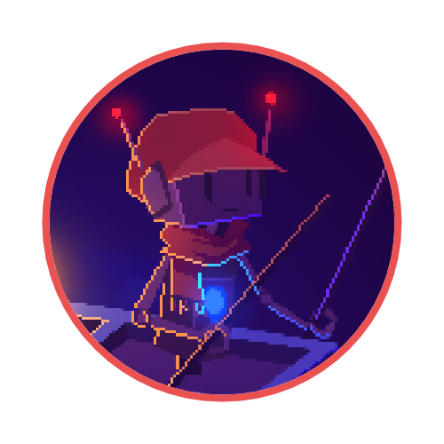

  

# Rowbot

一个大概可能会被用于 OneShot 相关QQ群的群聊机器人核心，基于[NoneBot2](https://v2.nonebot.dev/)框架（并默认使用 CQHTTP 协议）。由 Red_Cell 荣誉粗制滥造。

## 如何使用
将本repo下载或git clone到本地，编写配置文件(.env.*)，并安装任意CQHTTP协议端，按照[这里](https://v2.nonebot.dev/guide/cqhttp-guide.html)的指南连接本核心与协议端，您就可以使用了。
### 那怎么配置呢？
阅读根目录下的 .env.example ，里面对每个项目都打了注释，但您应该复制一份，并创建 .env.dev 和 .env.prod 对应开发环境和生产环境的配置

## 功wa能keng
> *（BOT）：现在还tm什么不会呢，最后考出来也就40多分*

### Retweet（编写中）
追踪Twitter（或更多平台）的特定用户或tag，定时发布或手动调出最新的图片

### NikoMaker（待定）
定做Niko对话框

### Entity (World Machine) RAP BATTLE（待定）
与世界机激情对线，大概会基于在线聊天API

### 更多功能...
您可以发issue提提建议或者干脆发个PR

## 开源协议
本项目使用[WTFPLv2许可证](http://www.wtfpl.net/)，这意味着对于本项目，字面意义上，您他妈的爱咋咋地，更多详情请查看 LICENSE 文件。并且本项目作为开源软件，概无保修。